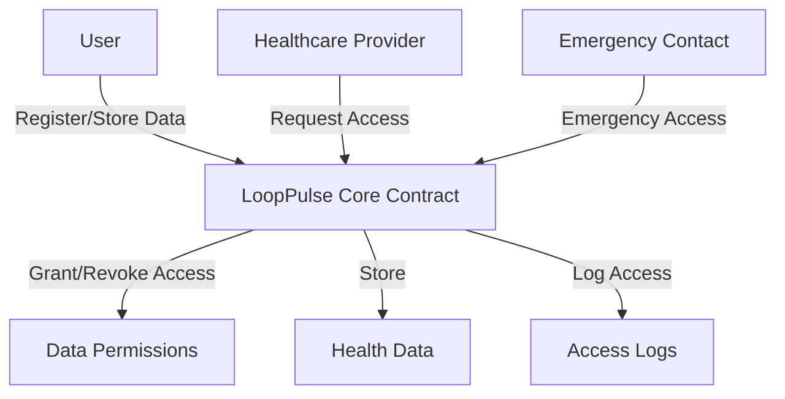

# Open Boost Specification

A decentralized, privacy-preserving data management protocol built on Stacks blockchain that enables secure, granular information sharing with advanced access controls.

## Overview

Open Boost provides a flexible, secure framework for managing sensitive data across various domains. The specification enables:

- Decentralized and privacy-preserving data storage
- Granular, time-limited access permissions
- Secure, selective information sharing
- Immutable access logging
- Emergency access mechanisms
- Robust encryption and access control strategies

## Architecture

The LoopPulse platform is built around a core smart contract that manages data storage, access controls, and permissions.



### Key Components
- **Users**: Register and manage their health data and access permissions
- **Healthcare Providers**: Can request access and add medical data with permission
- **Data Permissions**: Granular access control with expiration dates
- **Access Logs**: Immutable record of all data access events
- **Emergency Access**: Controlled access for designated emergency contacts

## Contract Documentation

### Open Boost Core Contract

The main contract (`open-boost-core.clar`) manages advanced data access and permission mechanisms:

#### Data Structures
- `users`: Decentralized user profiles
- `service-providers`: Registered and verified service providers
- `sensitive-data`: Encrypted, privacy-preserving records
- `access-permissions`: Granular access control
- `access-audit-log`: Comprehensive access tracking

#### Key Functions

##### Identity Management
```clarity
(define-public (register-entity (profile-data (optional (string-utf8 256))))
(define-public (update-entity-profile (profile-data (optional (string-utf8 256))))
```

##### Provider Registration
```clarity
(define-public (register-service-provider (provider-name (string-utf8 100)) (provider-type (string-utf8 50)))
(define-public (verify-service-provider (provider principal))
```

##### Data Management
```clarity
(define-public (add-sensitive-data (data-type (string-utf8 50)) (encrypted-data (string-utf8 1024)) (external-reference (optional (string-utf8 256))) (integrity-hash (string-utf8 64)))
(define-public (add-provider-data (user principal) (data-type (string-utf8 50)) (encrypted-data (string-utf8 1024)) (external-reference (optional (string-utf8 256))) (integrity-hash (string-utf8 64)))
```

##### Granular Access Control
```clarity
(define-public (grant-data-access (accessor principal) (data-scopes (list 20 (string-utf8 50))) (access-expiration (optional uint)))
(define-public (revoke-data-access (accessor principal) (permission-id uint))
```

## Getting Started

### Prerequisites
- Clarinet
- Stacks wallet
- Node.js environment

### Installation

1. Clone the repository
2. Install dependencies with Clarinet
```bash
clarinet integrate
```

### Usage Examples

1. Register as a user:
```clarity
(contract-call? .looppulse-core register-user (some "https://example.com/profile"))
```

2. Add health data:
```clarity
(contract-call? .looppulse-core add-health-data "heart-rate" "encrypted_data_here" none "checksum_here")
```

3. Grant access to a provider:
```clarity
(contract-call? .looppulse-core grant-access 'PROVIDER_ADDRESS (list "heart-rate" "blood-pressure") (some u100))
```

## Security Considerations

1. Data Encryption
   - All health data must be encrypted before storage
   - Only encrypted data URLs should be stored on-chain

2. Access Control
   - Regular audit of access permissions
   - Immediate revocation of compromised permissions
   - Time-limited access grants

3. Emergency Access
   - Carefully manage emergency contact settings
   - Regular verification of emergency access configuration

4. Provider Verification
   - Healthcare providers must be verified before accessing data
   - Regular review of provider credentials

## Development

### Testing

Run the test suite:
```bash
clarinet test
```

### Local Development

1. Start local Clarinet console:
```bash
clarinet console
```

2. Deploy contracts:
```bash
clarinet deploy
```

### Key Considerations

- Always verify transaction signatures
- Implement proper error handling
- Monitor gas costs for large operations
- Regular security audits
- Keep encrypted data backups off-chain